<p align="center">
  
  &nbsp;&nbsp;&nbsp;&nbsp;&nbsp;
  <picture>
    <source media="(prefers-color-scheme: dark)" srcset="assets/wordmark-dark.png" />
    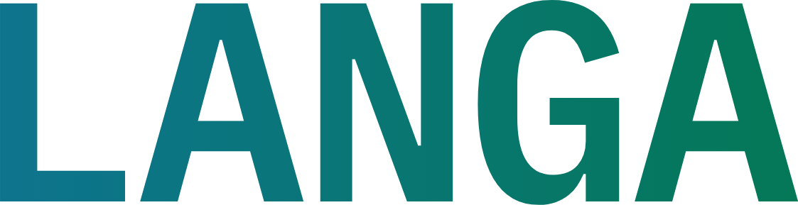
  </picture>
</p>

<p align="center">
  <b>Donner une place numérique aux langues d'Afrique</b><br>
  <i>le texte <b>et</b> la voix · portés par les communautés</i>
</p>

<p align="center">
  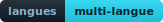
  
  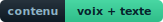
  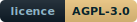
</p>

---

## 🌍 Le projet en quelques mots

La plupart des langues africaines se parlent tous les jours mais s'écrivent peu, et
elles restent presque absentes des outils numériques : on ne les trouve ni dans les
claviers, ni dans les dictionnaires en ligne, ni dans les traducteurs. **LANGIAL** est
une application ouverte à tous qui permet à chacun d'écrire, de prononcer et de
consulter les mots de sa langue, à l'écrit comme à l'oral, depuis un simple téléphone
ou un ordinateur.

La plateforme accueille **déjà plusieurs langues d'Afrique** et chacun peut y déclarer
la sienne si elle manque encore. Le **ngiemboon** (*Ngiembɔɔn*), une langue bamiléké de
l'Ouest du Cameroun, est la plus avancée : elle dispose d'un clavier dédié et du corpus
le plus riche.

> [!NOTE]
> L'application est **gratuite** et **ouverte à tous**. Elle s'utilise sur téléphone
> comme sur ordinateur, en **français** ou en **anglais**, avec un **thème clair** et un
> **thème sombre** au choix.

## 🧭 Ce que l'on fait dans l'application

L'application s'organise autour de quatre activités :

- 🎙️ &nbsp;**Transcrire** : prêter sa voix en prononçant un mot ou une phrase.
- ✍️ &nbsp;**Traduire** : écrire l'équivalent d'un mot entre le français et sa langue.
- 📚 &nbsp;**Explorer** : parcourir, lire et écouter ce que les autres ont déjà partagé.
- 📣 &nbsp;**Demander** : solliciter la communauté lorsqu'un mot nous échappe.

Ces quatre portes sont accessibles à tout moment depuis le menu du haut, et l'on passe
librement de l'une à l'autre.

Les captures qui suivent alternent le **thème sombre** et le **thème clair** :
l'application propose les deux ambiances, au choix de chacun.

### L'accueil et ses quatre portes

<p align="center">
  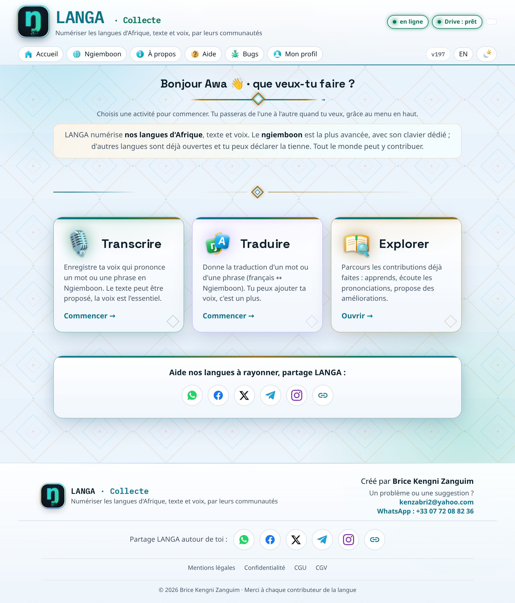
</p>

L'accueil présente les quatre activités comme des portes distinctes, chacune avec sa
couleur d'identité : le violet pour la transcription, le vert pour la traduction, l'or
pour l'exploration et le cyan pour la demande. On reconnaît ainsi chaque espace d'un
coup d'œil, et l'on ouvre celui que l'on veut. Le menu du haut reste présent partout
pour changer d'activité, de langue ou de thème.

### ✍️ Traduire, avec un clavier fait pour la langue

<p align="center">
  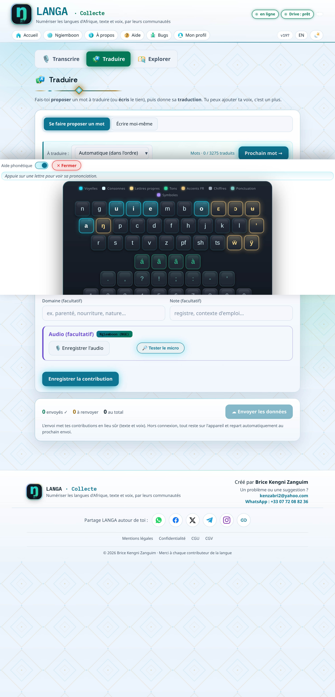
</p>

Traduire consiste à donner l'équivalent d'un mot ou d'une phrase entre le français et la
langue choisie. On peut se laisser proposer un mot du corpus, qui compte déjà plusieurs
milliers d'entrées, ou saisir librement le sien. Comme les lettres et les tons propres
aux langues africaines ne figurent pas sur un clavier ordinaire, LANGIAL fournit un
**clavier virtuel dédié** qui s'ouvre au moment où l'on touche le champ de saisie, à la
manière d'une application de messagerie.

Ce clavier regroupe les caractères par familles colorées : les voyelles, les consonnes,
les lettres propres à la langue comme ɛ, ɔ, ʉ, ŋ, ẅ et ÿ, les tons posés sur la voyelle,
et la ponctuation. Une aide phonétique permet d'appuyer sur une lettre pour entendre
comment elle se prononce. Pendant la frappe, un **texte prédictif** propose des mots
réels déjà présents dans la langue, ce qui accélère la saisie et aide à garder une
orthographe cohérente.

### 🎙️ Transcrire, pour la prononciation

<p align="center">
  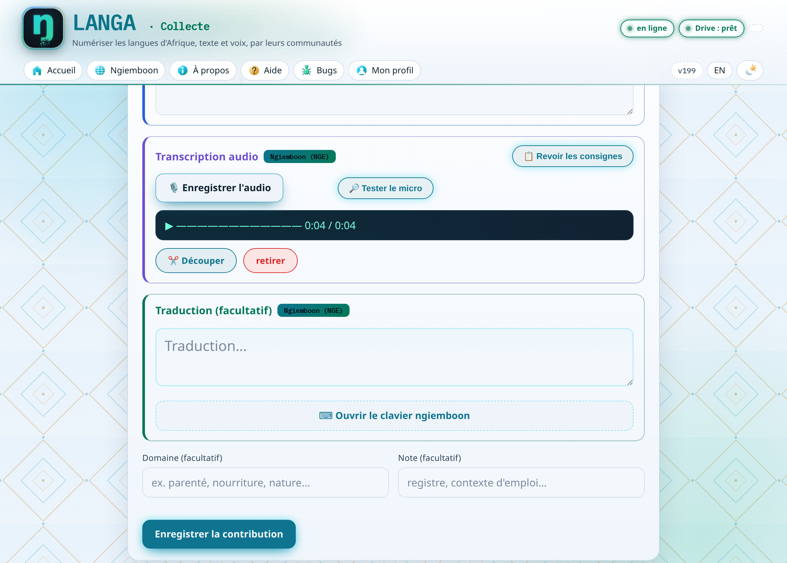
</p>

Beaucoup de personnes parlent leur langue sans l'écrire, et la voix tient donc une place
centrale. Transcrire, c'est enregistrer sa propre prononciation d'un mot ou d'une
phrase, la traduction écrite restant facultative. Une consigne rappelle l'essentiel
avant de commencer : se placer dans un endroit calme, parler lentement et distinctement,
et dire le mot une seule fois.

Comme un enregistrement se passe rarement du premier coup, l'outil audio permet de **ne
garder que le bon passage**, en délimitant la portion utile sur la forme d'onde ou en
secondes, avec une pré écoute avant de valider, et un nettoyage automatique des silences.
On peut aussi retirer l'enregistrement pour recommencer.

### 📣 Demander à la communauté

<p align="center">
  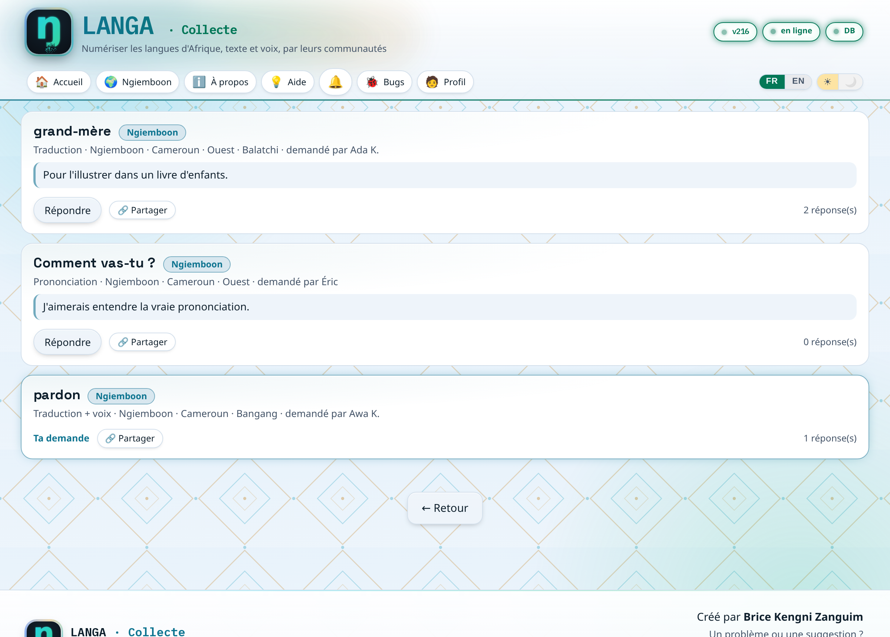
</p>

La porte Demander permet de solliciter la communauté lorsqu'on cherche la traduction ou
la prononciation d'un mot dans une langue précise. On lance un appel en indiquant le
pays, la région et un peu de contexte. Les personnes qui parlent cette langue sont
prévenues et invitées à répondre, tandis que les autres reçoivent un message tout prêt
pour relayer la demande autour d'elles. On répond directement sur place, en écrivant ou
en enregistrant sa voix, et cette réponse rejoint la bibliothèque commune tout en
avertissant la personne qui avait posé la question. Si le mot demandé n'existe pas
encore, il vient s'ajouter à la liste des mots à traduire.

### Le fil « à traduire »

<p align="center">
  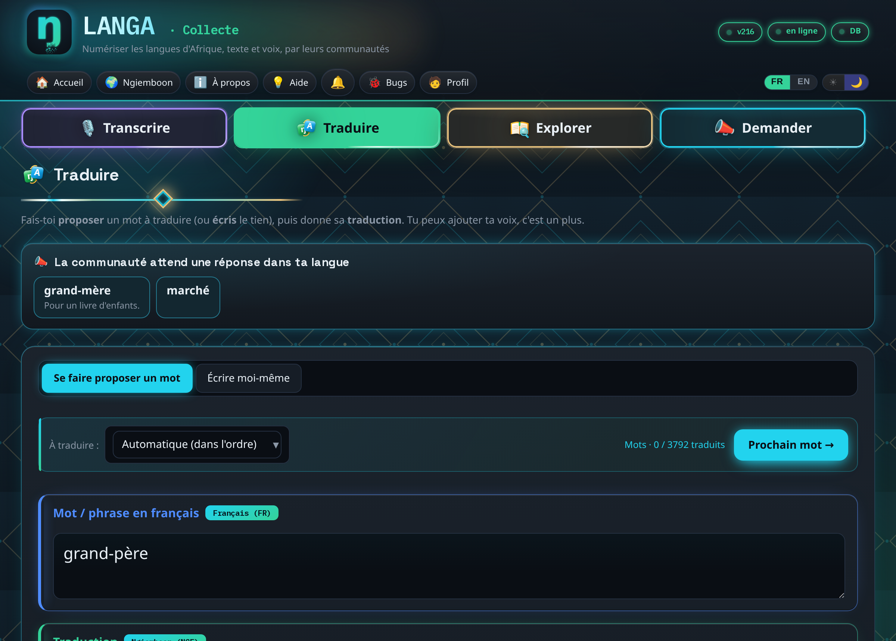
</p>

En haut des parcours Traduire et Transcrire, un bandeau apparaît lorsqu'une demande
concerne l'une de nos langues. Il indique que « la communauté attend une réponse dans ta
langue » et présente les mots concernés sous forme de pastilles. Un clic charge le mot
demandé, et la réponse donnée compte à la fois comme une entrée de la bibliothèque et
comme une réponse à la personne. On retrouve aussi sur cette vue les quatre onglets
d'activité, présents en haut des pages, chacun dans sa couleur.

### 📚 Explorer la bibliothèque et la carte des variantes

<p align="center">
  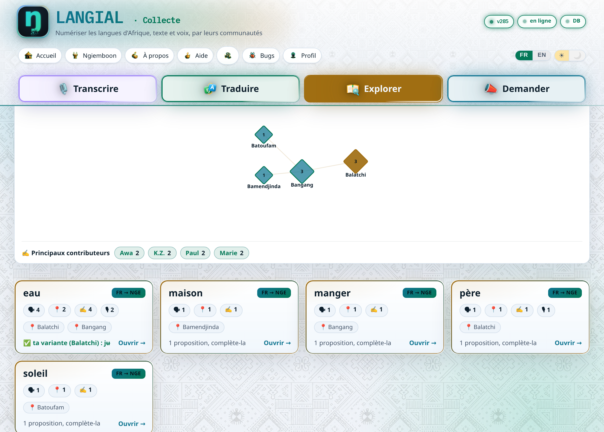
</p>

Explorer donne accès à l'ensemble des contributions. La bibliothèque se parcourt, se
cherche et se filtre, et elle s'exporte dans plusieurs formats standards afin que les
données restent réutilisables ailleurs, y compris par des outils de linguistique. Au
dessus des mots, une **carte des variantes** montre d'où viennent les contributions,
village par village, chaque losange étant dimensionné par le nombre de contributions du
lieu. Pour une langue bamiléké, la prononciation et le vocabulaire changent d'un village
à l'autre, et la carte rend cette diversité visible plutôt que de la gommer.

### Le détail d'un mot, pour écouter et lire

<p align="center">
  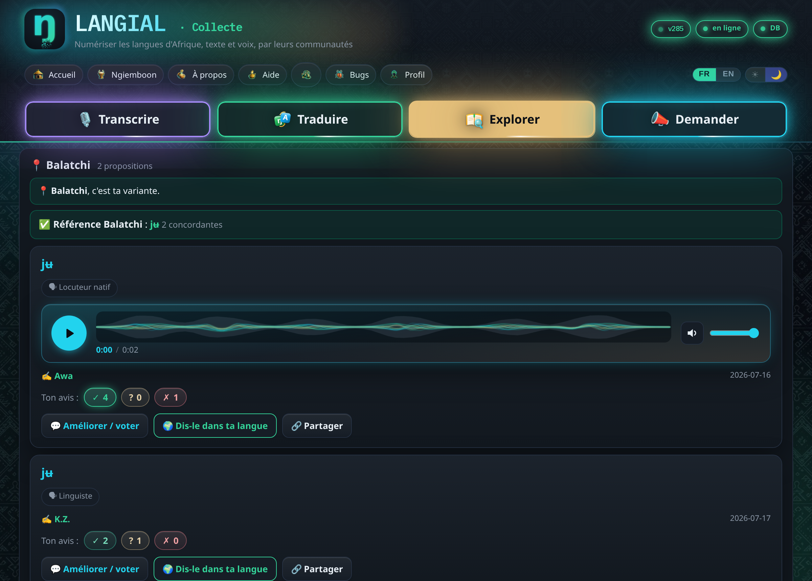
</p>

En ouvrant un mot, on découvre tout ce que différentes personnes en ont proposé,
regroupé par village. Chaque proposition indique le **rôle** de son auteur, locuteur
natif, apprenant ou linguiste. La **prononciation** se joue directement dans un lecteur à
forme d'onde, et lorsque plusieurs réponses concordent, un **consensus** met en avant la
version de référence d'un village. Chaque proposition porte enfin une **pastille de vote
à trois choix**, juste en vert, doute en jaune et faux en rouge, que les locuteurs
utilisent pour signaler la justesse d'un coup d'œil.

### Améliorer une contribution

<p align="center">
  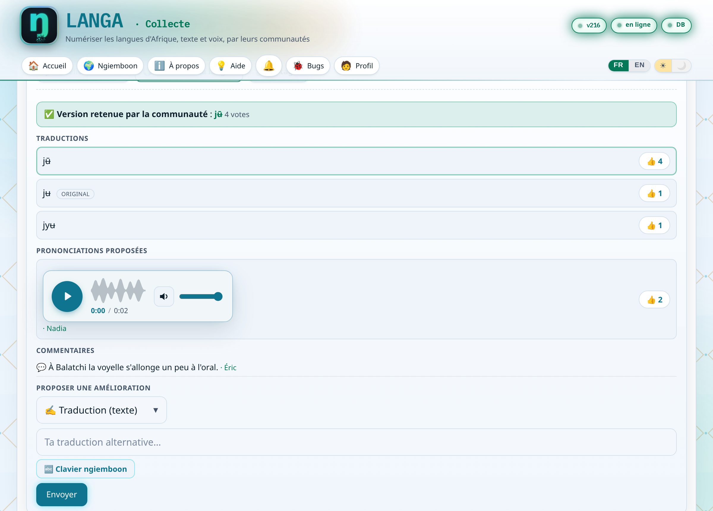
</p>

Sous chaque proposition, un panneau d'amélioration réunit les outils d'un travail
commun. On y vote pour la traduction la plus juste, la mieux corroborée devenant la
version retenue par la communauté, on écoute les prononciations alternatives, on lit les
commentaires, et l'on peut soi même proposer une meilleure écriture, une nouvelle voix
ou une remarque. La qualité se construit ainsi par accord entre pairs, et une entrée peut
se corriger et s'affiner avec le temps.

### Les notifications

<p align="center">
  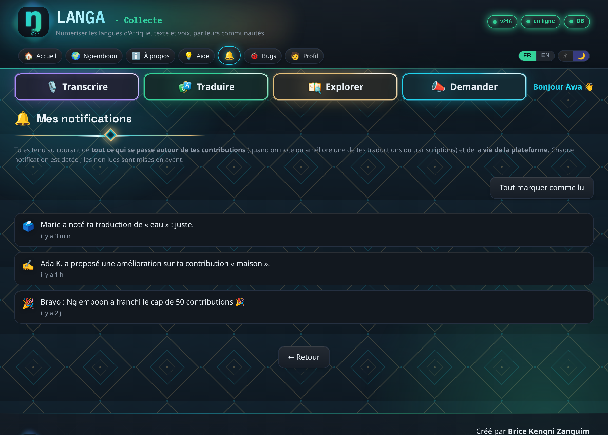
</p>

Chacun est tenu au courant de ce qui touche à ses propres contributions, par exemple
lorsqu'une de ses traductions est notée ou améliorée, ainsi que de la vie de la langue,
comme le franchissement d'un palier de contributions. Un centre de notifications daté
conserve l'historique, une pastille signale les messages non lus, et un rappel discret
peut apparaître à l'ouverture. Le prénom d'une autre personne n'apparaît que si elle a
autorisé l'affichage de son nom, sinon la notification reste anonyme.

### Une plateforme multi-langue

<p align="center">
  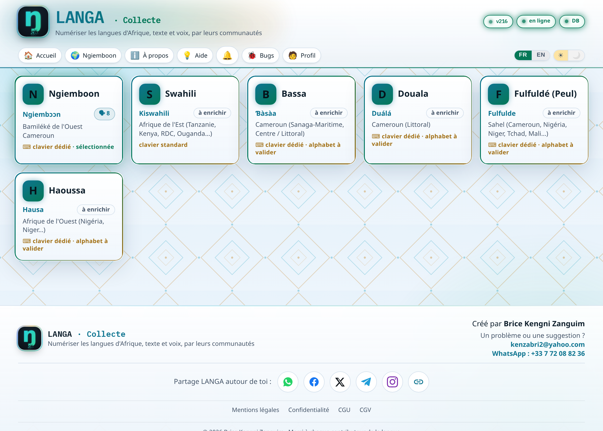
</p>

L'écran de choix présente les langues déjà ouvertes avec leur nom propre et leur région,
et chacun peut **déclarer la sienne** si elle manque, ce qui la rend aussitôt
enrichissable par tous. Comme deux personnes peuvent créer sans le savoir la même langue
sous deux orthographes différentes, un mécanisme de réunion permet de signaler que deux
langues déclarées n'en font qu'une, et de les fusionner sans rien perdre, les
orthographes devenant des noms alternatifs et les régions se cumulant.

### Français et anglais

<p align="center">
  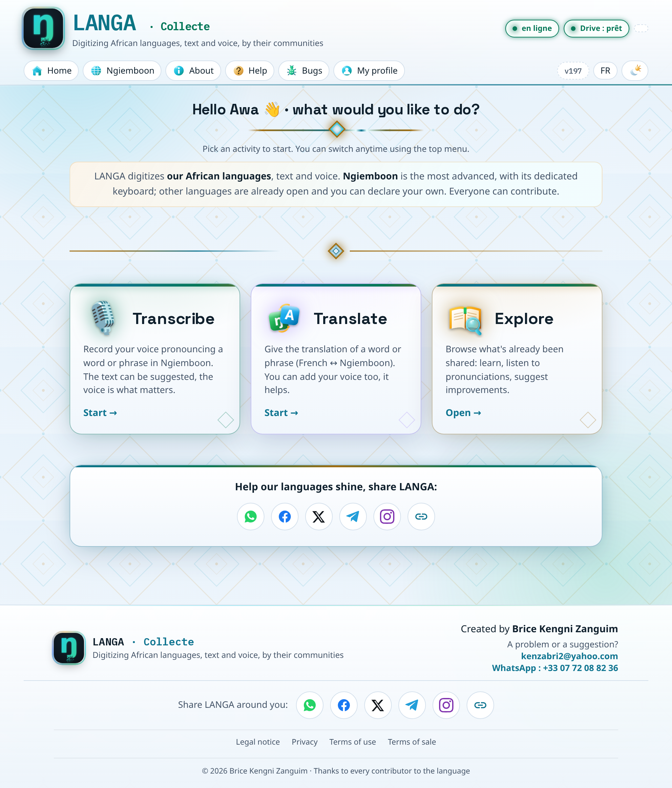
</p>

Toute l'interface bascule en anglais d'un seul geste, y compris les mots et les phrases à
traduire, qui s'affichent alors dans la langue de lecture de la personne. Les
francophones gardent le français, les anglophones lisent l'anglais, et chacun peut
contribuer dans la langue qui lui convient.

## ✨ Aides et repères

Une visite guidée accueille le nouveau venu, et de courtes bulles d'aide expliquent
chaque champ au moment où l'on s'en sert. Chaque entrée de la bibliothèque dispose d'un
bouton de partage. L'application s'habille de motifs inspirés du Ndop et reprend, page
après page, la couleur de chaque activité.

## ▶️ Ouvrir l'application

Pour ouvrir l'application en local, on sert le dossier `app/collecte/` avec n'importe
quel serveur de fichiers, puis on ouvre l'adresse affichée :

```bash
cd app/collecte
python3 -m http.server 8000
# puis ouvrir http://localhost:8000/ dans un navigateur
```

Le clavier virtuel ngiemboon est aussi disponible seul, comme démonstration autonome,
dans `app/keyboard/clavier.html`.

## 🗂️ Structure du dépôt

| Dossier | Contenu |
|---------|---------|
| `app/collecte/` | L'application : les quatre parcours (Transcrire, Traduire, Explorer, Demander), le clavier, l'outil audio, la bibliothèque, les notifications et l'aide guidée. |
| `app/keyboard/` | Le clavier virtuel ngiemboon, sous forme de composant réutilisable, avec `clavier.html` comme démonstration autonome. |
| `app/flyer/` | Le flyer de présentation partageable, en image et en PDF, avec son QR encadré de motifs Ndop. |
| `assets/` | Le logo et les captures d'écran utilisées dans ce document. |

## 🔤 L'alphabet ngiemboon en bref

- **8 voyelles** : a e ɛ i o ɔ u ʉ
- **24 consonnes** : b c d f g h j k l m n ŋ p r pf s sh t ts v ẅ ÿ z ʼ
- **5 tons**, marqués par un accent sur la voyelle : haut `á`, bas non marqué `a`,
  haut descendant `â`, montant `ǎ` et bas descendant `à`

Le corpus proposé à la traduction réunit plusieurs milliers de mots et de phrases du
quotidien, ainsi que les nombres et les chiffres, chaque entrée étant accompagnée de son
équivalent anglais. Les éléments publiés dans ce dépôt sont uniquement des contenus
libres de droits, à savoir la graine de vocabulaire vérifiée par l'auteur et les
contributions de la communauté.

## ⚖️ Licence

Le **code** est distribué sous licence **GNU Affero General Public License v3.0
(AGPL-3.0)**, dont le texte figure dans [`LICENSE`](LICENSE). En résumé, le code reste
ouvert : toute redistribution, tout fork et tout service en ligne dérivé doit republier
son propre code source sous la même licence.

## 👤 Auteur

**Brice Kengni Zanguim**

---

<p align="center">
  <br>
  <sub>© 2026 Brice Kengni Zanguim</sub>
</p>
